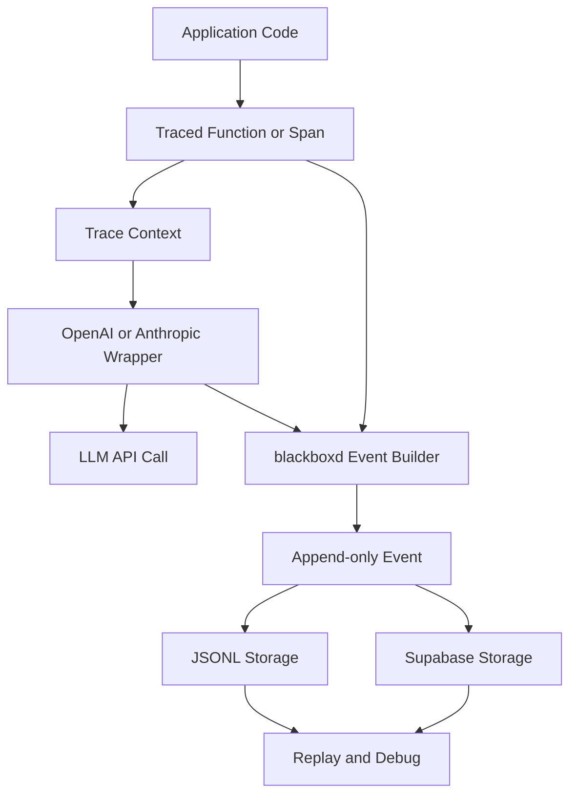

# blackboxd

`blackboxd` is a lightweight SDK for append-only LLM prompt/response logging. It is built for debugging, replay, and auditability without adding a proxy, gateway, or heavy observability stack.

## Principles

- Append-only event log
- Local-first developer workflow
- Minimal setup and dependencies
- Decorator and context-manager based tracing
- Structured JSON persistence
- Replayable logs for scripts, APIs, jobs, and agent pipelines

## Install

```bash
pip install -e .
pip install -e ".[openai,anthropic,supabase,fastapi,dev]"
```

## Quick Start

```python
from blackboxd import OpenAI, configure, trace_llm, trace_span

configure(
    storage=".blackboxd/logs.jsonl",
    environment="development",
    app_version="0.1.0",
    default_tags=["receipt-review"],
)

client = OpenAI()


@trace_llm(tags=["pipeline"])
def review_receipt(text: str) -> str:
    with trace_span("classify", metadata={"step": "classify"}):
        response = client.responses.create(
            model="gpt-4.1-mini",
            input=f"Review this receipt: {text}",
        )
    return response.output_text
```

## Processing Flow



The typical flow is: your application enters a traced function or span, `blackboxd` creates or propagates trace context, the provider wrapper captures the LLM request and response, and the resulting event is persisted to JSONL or Supabase for later replay and debugging.

## What Gets Captured

Each event stores:

- `timestamp` via `created_at` and `ended_at`
- `trace_id`
- `span_id`
- `parent_span_id`
- `provider`
- `model`
- `prompt`
- `response`
- `latency_ms`
- `input_tokens`
- `output_tokens`
- `tags`
- `metadata`
- `error`
- `environment`
- `app_version`

## Core API

### `trace_llm`

```python
from blackboxd import trace_llm


@trace_llm(tags=["batch"])
def run_batch():
    ...
```

### `trace_span`

```python
from blackboxd import trace_span

with trace_span("validate", metadata={"stage": "post-check"}):
    ...
```

### `configure`

```python
from blackboxd import JSONLStorage, SupabaseStorage, configure

configure(storage=JSONLStorage(".blackboxd/logs.jsonl"))

configure(
    storage=SupabaseStorage("postgresql://postgres:<password>@db.<project-ref>.supabase.co:5432/postgres?sslmode=require"),
    environment="production",
    app_version="2026.05.07",
)
```

## Storage Backends

### JSONL

Default local-first backend:

```python
from blackboxd import configure

configure(storage=".blackboxd/logs.jsonl")
```

Example event:

```json
{
  "id": "0b1ee5df-d3ad-4028-9f5a-ae49b31ce76d",
  "kind": "llm",
  "name": "openai.responses.create",
  "created_at": "2026-05-07T13:00:00+00:00",
  "ended_at": "2026-05-07T13:00:00.123000+00:00",
  "latency_ms": 123,
  "trace_id": "a212f9c2-f9a0-4f53-9bd2-5b9a7758f8d1",
  "span_id": "c72b819c-66ef-43b4-87da-609c25764d27",
  "parent_span_id": "d8d4df0d-4b2c-4979-81ec-a51989e11d43",
  "provider": "openai",
  "model": "gpt-4.1-mini",
  "prompt": {"input": "Review this receipt"},
  "response": {"output_text": "Approved"},
  "metadata": {"step": "classify"},
  "tags": ["receipt-review", "pipeline"],
  "input_tokens": 18,
  "output_tokens": 7,
  "error": null,
  "environment": "development",
  "app_version": "0.1.0"
}
```

### Supabase

```python
from blackboxd import SupabaseStorage, configure

storage = SupabaseStorage(
    "postgresql://postgres:<password>@db.<project-ref>.supabase.co:5432/postgres?sslmode=require"
)
configure(storage=storage)
```

`SupabaseStorage` connects directly to your Supabase Postgres database and creates `public.llm_logs` automatically by default.

Recommended environment variables:

```bash
export SUPABASE_DB_DSN="postgresql://postgres:<password>@db.<project-ref>.supabase.co:5432/postgres?sslmode=require"
```

```python
import os

from blackboxd import SupabaseStorage, configure

configure(storage=SupabaseStorage(os.environ["SUPABASE_DB_DSN"]))
```

## Provider Wrappers

### OpenAI

```python
from blackboxd import OpenAI

client = OpenAI()
response = client.responses.create(
    model="gpt-4.1-mini",
    input="Summarize this receipt.",
)
```

Supported MVP capture points:

- `client.responses.create(...)`
- `client.chat.completions.create(...)`

### Anthropic

```python
from blackboxd import Anthropic

client = Anthropic()
response = client.messages.create(
    model="claude-3-5-sonnet-latest",
    max_tokens=300,
    messages=[{"role": "user", "content": "Review this receipt."}],
)
```

Supported MVP capture points:

- `client.messages.create(...)`

## Examples

- Local script: [examples/local_script.py](examples/local_script.py)
- FastAPI integration: [examples/fastapi_app.py](examples/fastapi_app.py)

Run the FastAPI example:

```bash
uvicorn examples.fastapi_app:app --reload
```

## Replay and Query Examples

### JSONL with `jq`

```bash
jq 'select(.kind == "llm" and .provider == "openai")' .blackboxd/logs.jsonl
jq 'select(.response | tostring | test("approve"; "i"))' .blackboxd/logs.jsonl
```

### Supabase SQL

```sql
SELECT *
FROM public.llm_logs
WHERE response::text ILIKE '%approve%';

SELECT trace_id, provider, model, latency_ms, error
FROM public.llm_logs
WHERE kind = 'llm'
ORDER BY created_at DESC
LIMIT 50;
```

## Notes

- This project is intentionally not a full observability platform.
- The architecture is kept simple so later exports to OpenTelemetry, Kafka, or S3 can be added without changing the tracing API.
- Supabase is the default hosted database target for structured persistence in this repository.

## TypeScript SDK

The repository also includes a Node and TypeScript implementation under [typescript/README.md](typescript/README.md). It uses `AsyncLocalStorage` for trace propagation and supports JSONL plus Supabase storage.
