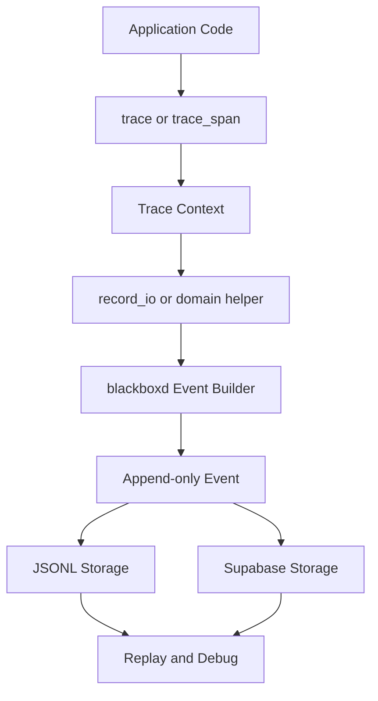

# blackboxd

`blackboxd` is a lightweight SDK for append-only input/output event logging. It is built for debugging, replay, and auditability without adding a proxy, gateway, or heavy observability stack. LLM tracing is a first-class use case, but the core API is provider-agnostic.

## Principles

- Append-only event log
- Local-first developer workflow
- Minimal setup and dependencies
- Decorator and context-manager based tracing
- Generic input/output event recording
- Structured JSON persistence
- Replayable logs for scripts, APIs, jobs, and agent pipelines

## Install

```bash
pip install -e .
pip install -e ".[openai,anthropic,httpx,supabase,fastapi,dev]"
```

## Quick Start

```python
from blackboxd import configure, record_io, trace, trace_span

configure(
    storage=".blackboxd/logs.jsonl",
    environment="development",
    app_version="0.1.0",
    default_tags=["receipt-review"],
)

@trace(tags=["pipeline"])
def review_receipt(text: str) -> dict:
    with trace_span("normalize", metadata={"step": "normalize"}):
        normalized = text.strip().lower()

    record_io(
        name="classify_document",
        input_data={"text": normalized},
        output_data={"label": "receipt", "confidence": 0.98},
        metadata={"stage": "classification"},
    )
    return {"status": "ok"}
```

## Processing Flow



The typical flow is: your application enters a traced function or span, `blackboxd` creates or propagates trace context, your code records an input/output event, and the resulting event is persisted to JSONL or Supabase for later replay and debugging.

## What Gets Captured

Each event stores:

- `timestamp` via `created_at` and `ended_at`
- `event_type`
- `trace_id`
- `span_id`
- `parent_span_id`
- `input`
- `output`
- `latency_ms`
- `tags`
- `metadata`
- `error`
- `environment`
- `app_version`

LLM-specific integrations may also add:

- `provider`
- `model`
- `input_tokens`
- `output_tokens`

## Core API

### `trace`

```python
from blackboxd import trace


@trace(tags=["batch"])
def run_batch():
    ...
```

### `record_io`

```python
from blackboxd import record_io

record_io(
    name="classify_document",
    input_data={"text": "hello"},
    output_data={"label": "receipt"},
)
```

### `trace_llm`

Compatibility alias around `trace(...)` for LLM-oriented call sites.

```python
from blackboxd import trace_llm


@trace_llm(tags=["batch"])
def run_batch():
    ...
```

### `trace_span`

```python
from blackboxd import trace_span

with trace_span("validate", metadata={"stage": "post-check"}):
    ...
```

### `configure`

```python
from blackboxd import JSONLStorage, SupabaseStorage, configure

configure(storage=JSONLStorage(".blackboxd/logs.jsonl"))

configure(
    storage=SupabaseStorage("postgresql://postgres:<password>@db.<project-ref>.supabase.co:5432/postgres?sslmode=require"),
    environment="production",
    app_version="2026.05.07",
)
```

## Python Integration Patterns

`blackboxd` supports multiple adoption styles so you can compare how invasive each approach is in an existing codebase.

### 1. Wrapper Client

Best for new code or codebases that can replace imports cleanly.

```python
from blackboxd import OpenAI

client = OpenAI()
response = client.responses.create(model="gpt-4.1-mini", input="Review this receipt.")
```

### 2. Decorator And Span

Best when you want business-level spans even if the LLM client stays unchanged.

```python
from blackboxd import trace_llm, trace_span


@trace_llm(tags=["review"])
def review(text: str):
    with trace_span("classify"):
        return client.responses.create(model="gpt-4.1-mini", input=text)
```

### 3. Instrument An Existing Client

Best default for existing code because you keep your current SDK client and add tracing afterward.

```python
from openai import OpenAI

from blackboxd import instrument_openai

client = instrument_openai(OpenAI())
response = client.responses.create(model="gpt-4.1-mini", input="Review this receipt.")
```

### 4. Instrument HTTP Transport

Best when you already standardize on `httpx.Client` and want one shared transport-level hook.

```python
import httpx
from openai import OpenAI

from blackboxd import BlackboxdTransport

http_client = httpx.Client(
    transport=BlackboxdTransport(httpx.HTTPTransport(), provider="openai")
)
client = OpenAI(http_client=http_client)
```

### 5. Monkey Patch

Best only for experiments or short-lived migrations. It keeps call sites almost unchanged but is the most fragile approach.

```python
from openai import OpenAI

from blackboxd import patch_openai

client = OpenAI()
handles = patch_openai(client)
```

### Recommendation

- For the most stable core integration: use `trace(...)`, `trace_span(...)`, and `record_io(...)`.
- For greenfield code: wrapper client or decorator-based tracing are both reasonable.
- For existing production code: `instrument_openai(...)` or `instrument_anthropic(...)` is usually the easiest path.
- For shared platform teams: HTTP transport instrumentation is often the cleanest cross-project integration.
- For quick evaluation only: monkey patching is useful, but it should not be the primary long-term API.

## Storage Backends

### JSONL

Default local-first backend:

```python
from blackboxd import configure

configure(storage=".blackboxd/logs.jsonl")
```

Example event:

```json
{
  "id": "0b1ee5df-d3ad-4028-9f5a-ae49b31ce76d",
  "kind": "llm",
  "name": "openai.responses.create",
  "created_at": "2026-05-07T13:00:00+00:00",
  "ended_at": "2026-05-07T13:00:00.123000+00:00",
  "latency_ms": 123,
  "trace_id": "a212f9c2-f9a0-4f53-9bd2-5b9a7758f8d1",
  "span_id": "c72b819c-66ef-43b4-87da-609c25764d27",
  "parent_span_id": "d8d4df0d-4b2c-4979-81ec-a51989e11d43",
  "provider": "openai",
  "model": "gpt-4.1-mini",
  "prompt": {"input": "Review this receipt"},
  "response": {"output_text": "Approved"},
  "metadata": {"step": "classify"},
  "tags": ["receipt-review", "pipeline"],
  "input_tokens": 18,
  "output_tokens": 7,
  "error": null,
  "environment": "development",
  "app_version": "0.1.0"
}
```

### Supabase

```python
from blackboxd import SupabaseStorage, configure

storage = SupabaseStorage(
    "postgresql://postgres:<password>@db.<project-ref>.supabase.co:5432/postgres?sslmode=require"
)
configure(storage=storage)
```

`SupabaseStorage` connects directly to your Supabase Postgres database and creates `public.llm_logs` automatically by default.

Recommended environment variables:

```bash
export SUPABASE_DB_DSN="postgresql://postgres:<password>@db.<project-ref>.supabase.co:5432/postgres?sslmode=require"
```

```python
import os

from blackboxd import SupabaseStorage, configure

configure(storage=SupabaseStorage(os.environ["SUPABASE_DB_DSN"]))
```

## Provider Wrappers

### OpenAI

```python
from blackboxd import OpenAI

client = OpenAI()
response = client.responses.create(
    model="gpt-4.1-mini",
    input="Summarize this receipt.",
)
```

Supported MVP capture points:

- `client.responses.create(...)`
- `client.chat.completions.create(...)`

### Anthropic

```python
from blackboxd import Anthropic

client = Anthropic()
response = client.messages.create(
    model="claude-3-5-sonnet-latest",
    max_tokens=300,
    messages=[{"role": "user", "content": "Review this receipt."}],
)
```

Supported MVP capture points:

- `client.messages.create(...)`

## Examples

- Local script: [examples/local_script.py](examples/local_script.py)
- Generic I/O pipeline: [examples/generic_io_pipeline.py](examples/generic_io_pipeline.py)
- FastAPI integration: [examples/fastapi_app.py](examples/fastapi_app.py)
- Existing client instrumentation: [examples/openai_instrument_existing_client.py](examples/openai_instrument_existing_client.py)
- HTTP transport pattern: [examples/httpx_transport_pattern.py](examples/httpx_transport_pattern.py)
- Monkey patch pattern: [examples/monkey_patch_pattern.py](examples/monkey_patch_pattern.py)

Run the FastAPI example:

```bash
uvicorn examples.fastapi_app:app --reload
```

## Replay and Query Examples

### JSONL with `jq`

```bash
jq 'select(.kind == "llm" and .provider == "openai")' .blackboxd/logs.jsonl
jq 'select(.response | tostring | test("approve"; "i"))' .blackboxd/logs.jsonl
```

### Supabase SQL

```sql
SELECT *
FROM public.llm_logs
WHERE response::text ILIKE '%approve%';

SELECT trace_id, provider, model, latency_ms, error
FROM public.llm_logs
WHERE kind = 'llm'
ORDER BY created_at DESC
LIMIT 50;
```

## Notes

- This project is intentionally not a full observability platform.
- The architecture is kept simple so later exports to OpenTelemetry, Kafka, or S3 can be added without changing the tracing API.
- Supabase is the default hosted database target for structured persistence in this repository.

## TypeScript SDK

The repository also includes a Node and TypeScript implementation under [typescript/README.md](typescript/README.md). It uses `AsyncLocalStorage` for trace propagation and supports JSONL plus Supabase storage.
